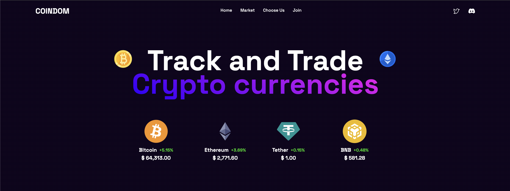
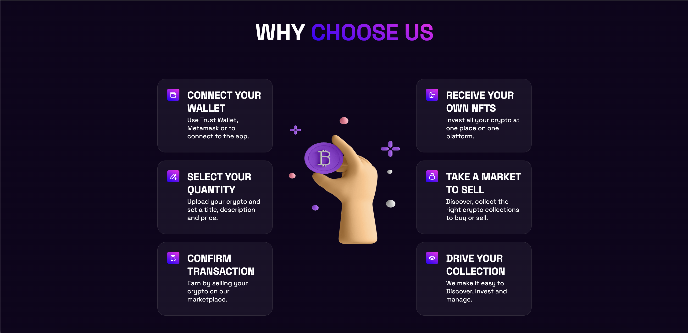

## Coindom - Crypto Search

Coindom - Crypto Search is a web agency that secures your crypto wallet permissions.


## The project includes:

- Adaptation: Full adaptation from the 1920px to the 360px.
- Home page: Live information about Crypto Market.
- API: API of CoinMarketCap which show live information about Crypto&


## Installation

1. Clone the repository:
    ```
      git clone https://github.com/username/repository.git
    ```
2. Go to the project directory:
    ```
      cd repository
    ```
3. Install Composer:
    ```
        composer install
    ```
3. Setting up the .env file:
    ```
        cp .env.example .env
    ```
3. Running Migrations:
    ```
        php artisan migrate
    ```
3. Starting the server:
    ```
        php artisan serve
    ```
    

## Technologies

- HTML
- CSS
- JavaScript
- PHP
- Laravel
- mySQL
- Git


## Screenshots
<p align="center">
    
    
    
    
</p>
